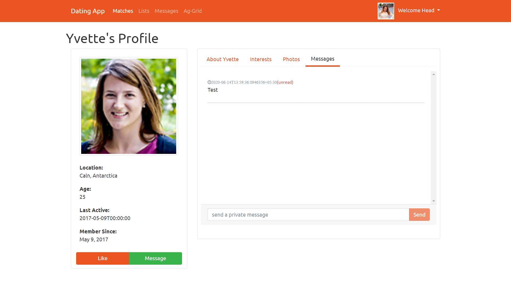
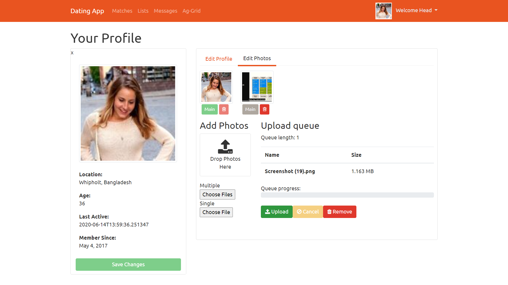
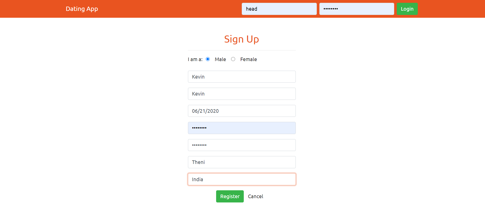
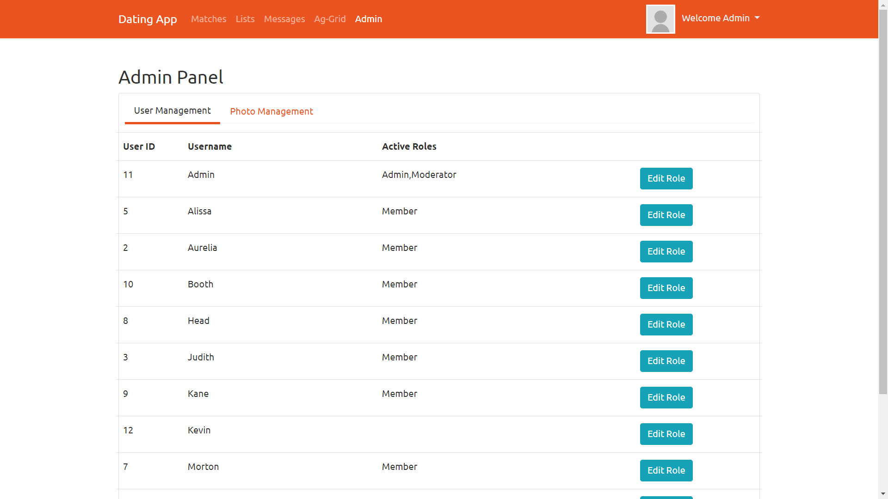
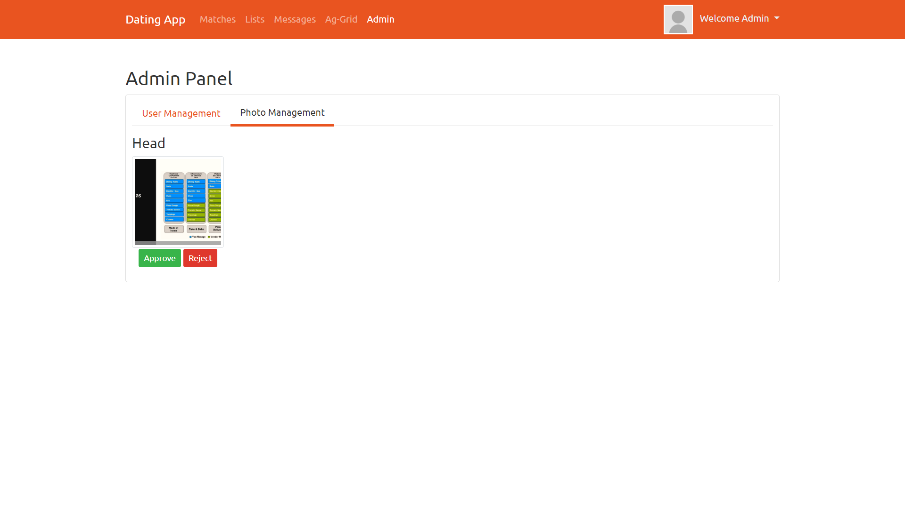
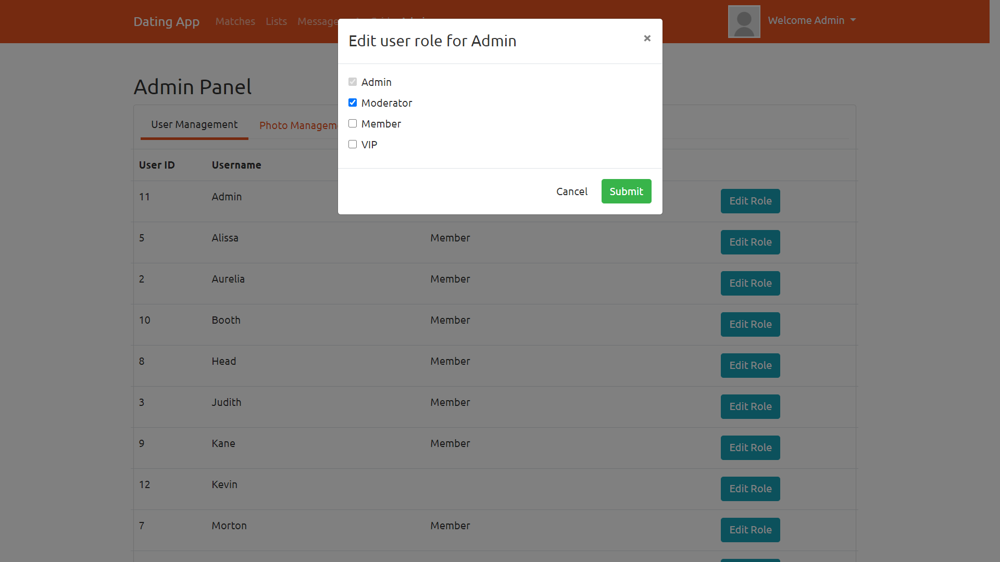
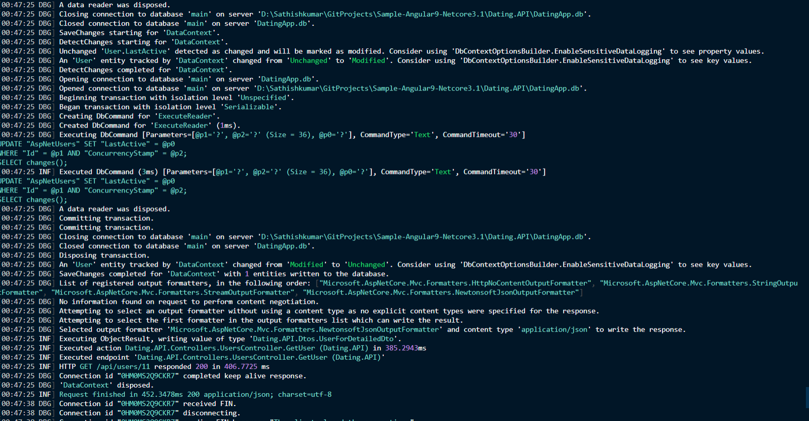
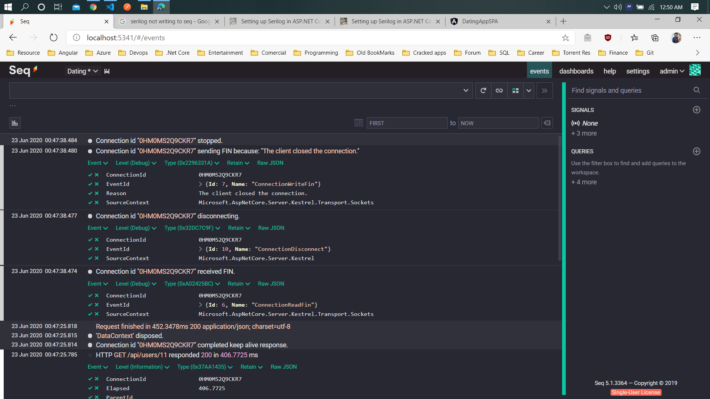
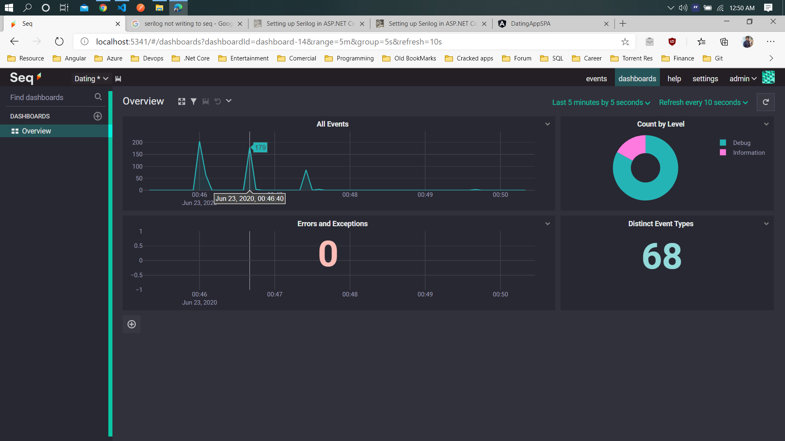

# Sample-Angular9-Netcore3.1

Application credentials:
________________________
User name: admin
password: password
-------------------------

Application Photos:
--------------------

#Angular 9
=================================
Features:
    Route Gaurd
    Angular JWT token
    NGX bootstrap
    Alertify Service
    Auth0/JwtModule for set token
    Ngx-galler-9
    Route Resolver
    Tslint Rules
    Envirnoment url 
    typings.d.ts
    Template - driven Form  
    ViewChild - Template Reference
    CanDeactivate
    ng2-file upload
    HostListener 
    lite-server
    View Encapsulation 
    Reactive Forms - Custom validator
    Partial class 
    Time Ago Pipe, date pipe
    Features change css into scss - renamer
    Stop Event propagation 
    Ag grid
    Tap
    Custom Structual directive
    Rolebased authentication

Bootstrap: 
    Theme set
    Cards component
    Navigation Bar setup for page
    TabModule with custom css - style.css
    Date Picker - BsDatePickerModule
    FormGroup
    Container, Rows,  Column design
    image style

Useful commands:
----------------
    ng g guard auth --skipTests  : To generate route guard file

Route Resolver: 
---------------
    Basically, a Resolver acts like middleware, which can be executed before a component is loaded.
    Interface that classes can implement to be a data provider. A data provider class can be used with the router to resolve data during navigation. 
    The interface defines a resolve() method that will be invoked when the navigation starts. The router will then wait for the data to be resolved before the route is finally activated.

tslint.json
-----------
    Used to turn off warning rules of code design. Work like sonarlint rules for best code practice 

typings.d.ts
------------
    Import like 'import * as alertify from 'alertifyjs';' such as module support typescript, which is not available angular            customized.when we import it will show warning, to stop the warning, declare the module in this file.

Ngx-galler-9
-------------
    Display photos like our photo gallery view.

Auth0/JwtModule for set token
    Used to set jwt token automatically to every api call.

CanDeactivate: 
-------------
    Protect the route by clicking the back button mistakenly. Alert box will appear with custom msg 

HostListener:
-------------
    Listen the browser window like tab action or reload page to protect the user change from mistaken activity.

Any to any component Communication:
---------------------------------------
    BehaviorSubject Obeservable is used to communicate between the components. 

lite-server:
-------------
    Host the dist folder locally like iis server. To run lite-server --baseDir="dist"

View Encapsulation 
--------------------------
    None: Override the component css styles including the angular material at component level
    Native: 
    Emulated

Features change css into scss - renamer
---------------------------------------
    https://medium.com/@ngubanethabo.ambrose/migrate-from-css-to-scss-stylesheets-for-existing-angular-application-d61f8061f5b7

Ag Grid
-------------
    Advanced Grouping, sorting, export excel- work more like excel

Tap
-------------
    Execute before the subscibe method in pipe

Separate Operator
--------------------------
 separate operator convert return values as array elements

========================================================================================================================================

#.Net Core 3.1 
========================================
Features: 
    JSON Authentication
    EF core Migration
    Reposity Pattern
    SQLite Database
    CORS Enable
    Password Encryption with Salt Key
    Safe Secret
    AutoMapper
    Data Seeding
    Repository Pattern
    Update the user userful way 
    Cloudinary 
    Action Filter
    Fluent API
    Relationships in EF
    AutoMapper Amazing mapping of HttpPost Messages
    Identity for Rolebased model
    Global level filter in Entity modal
    Serilog

For Run App - dotnet run 
--------------------------
    For watch run - change in code automatically reload the app: dotnet watch run
    Create App: dotnet new webapi -n <<FolderName>>

Migration Code First Approach
---------------------------------------
1. dotnet ef  migrations add <<Name>> -- Create ModelBuilder file from context menu
2. dotnet ef database update -- Create or update the database
3. dotnet ef database drop -- Drop the database

Safe Secret 
-------------
    used to store screte information like config token key, in production used to store envirnoment , local development - use super Secret

Data Seeding
-------------
    Snippet for JSON Generator site at https://www.json-generator.com/
    Generate the JSON object randomly 

Reposity Pattern
--------------------------
    Used Generic Add, Delete functionlity to avoid code repition
    Separation of Data and Service layers

Cloudinary  
-------------
    Cloud platform for video/image secure upload with access keys, support image scaling and much formating options

Action Filter
-------------
    Used to monitor the activity of action (controller methods), next() execute after the Action method is executed

Fluent API
-------------
  Model builder oncreatingmodel specify the table specification 

Global level filter in Entity model
---------------------------------------
    Used to filter the Db context objects at globally, it will be configured in db context modal creation

Serilog
---------------------------------------
    Structured logging APIs, and receives log events from the ASP.NET Core framework class libraries, but adds a stack of features that make it a more appealing choice for some kinds of apps and environments. Log4net or default log system in API not support structured logging.
    Ref: https://nblumhardt.com/2019/10/serilog-in-aspnetcore-3/
